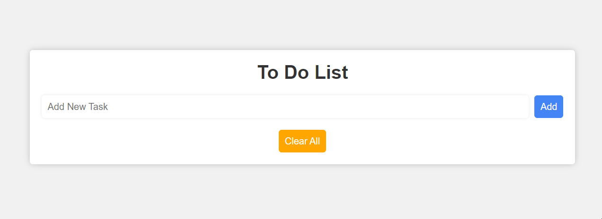

<!-- PROJECT LOGO -->
 

<h2 align="center">JS Projects</h2>

  

    <a href="https://github.com/Freekson/js-projects/issues">Report Bug</a>

  

<!-- TABLE OF CONTENTS -->

  
Table of Contents

  <ol>   
    <li><a href="#to-do-app">To do app</a></li>
  </ol>

# To do app

# Contact

Yehor Dreval

- [instagram](https://www.instagram.com/freeksons)
- [telegram](https://t.me/freekson)

Project Link: [Animations](https://github.com/Freekson/various-animations)

(<a href="#top">back to top</a>)

